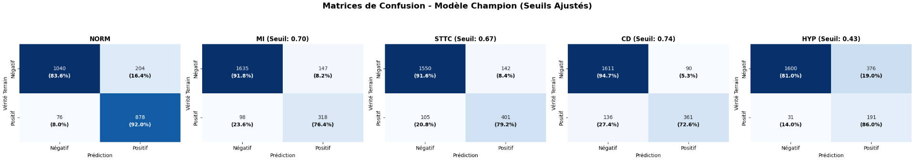

# Heart Reader — Deep Learning for Automated 12-Lead ECG Analysis

> A multimodal deep-learning research project for automated multi-label classification of 12-lead ECG recordings, combining attention-enhanced 1D CNNs, ECG-specific data augmentation, ensemble learning, ONNX deployment, and a FastAPI web application.

## Overview

**Heart Reader** is an end-to-end research prototype designed to classify 12-lead electrocardiograms into five diagnostic superclasses:

| Class | Description |
|---|---|
| **NORM** | Normal ECG |
| **MI** | Myocardial Infarction |
| **STTC** | ST/T Change |
| **CD** | Conduction Disturbance |
| **HYP** | Hypertrophy |

The project combines raw ECG signals with structured PTB-XL+ features and explores several techniques to improve robustness and representation learning.

### Final pipeline

```text
                         12-Lead ECG
                              │
                              ▼
                    Signal Preprocessing
                              │
          ┌───────────────────┼───────────────────┐
          │                   │                   │
        SWT             Masked Training     Noise / Scaling
          │                   │                   │
          └───────────────────┼───────────────────┘
                              ▼
                    Attention-Enhanced
                      1D CNN Models
                              │
             ┌────────────────┼────────────────┐
             ▼                ▼                ▼
        Inception1D       SE-ResNet1D      XResNet1D
             │                │                │
             └────────────────┼────────────────┘
                              ▼
                       Model Probabilities
                              │
                              ▼
                    Logistic Regression
                       Meta-Learner
                              │
                              ▼
                   5 Diagnostic Outputs
                              │
                              ▼
                     ONNX / FastAPI
                              │
                              ▼
                    Web ECG Interface
```

---

## ⭐ Final Experimental Result

The final notebook reports a **test Macro-AUC of 0.9290** for the stacked meta-learner on PTB-XL Fold 10.

| Metric | Result |
|---|---:|
| **Test Macro-AUC** | **0.9290** |
| Macro Precision | 0.67 |
| Macro Recall | 0.81 |
| Macro F1 | 0.72 |
| Weighted F1 | 0.77 |

The three attention-enabled base models achieved the following best validation Macro-AUC values:

| Model | Best Validation Macro-AUC | Best Epoch |
|---|---:|---:|
| **Inception1D + Attention** | 0.9282 | 9 |
| **SE-ResNet1D + Attention** | 0.9307 | 19 |
| **XResNet1D101 + Attention** | 0.9295 | 14 |

The meta-learner uses the five probabilities produced by each of the three models, resulting in **15 meta-features**.

---

# 🧠 Deep Learning Approach

## 1. Multi-Modal Learning

The model combines two sources of information:

### Raw ECG signal

```text
12 leads × 1000 samples
```

corresponding to a 10-second ECG sampled at 100 Hz.

### PTB-XL+ structured features

The multimodal branch uses **1,313 structured features** derived from the PTB-XL+ feature tables.

The structured branch is:

```text
1313 → 256 → 64
```

The resulting 64-dimensional representation is fused with a 256-dimensional signal representation before classification.

---

## 2. Attention-Enhanced CNNs

Three complementary 1D CNN architectures are trained:

- **Inception1D**
- **SE-ResNet1D**
- **XResNet1D101**

Each signal branch is followed by **4-head Multi-Head Self-Attention**, a residual connection, Layer Normalization, and adaptive average pooling.

```text
CNN Backbone
     ↓
Feature Sequence
     ↓
4-Head Multi-Head Attention
     ↓
Residual + LayerNorm
     ↓
Global Average Pooling
     ↓
256-D Signal Embedding
```

The signal embedding and structured-feature embedding are then fused:

```text
256 + 64 = 320
        ↓
     128
        ↓
      5 logits
```

---

# 🧪 ECG-Specific Data Augmentation

A major part of the project is the use of several training-time augmentation techniques designed for ECG signals.

## Stationary Wavelet Transform (SWT)

SWT augmentation operates in the wavelet domain using the **Daubechies-4 (`db4`) wavelet**.

For each selected training batch:

1. The ECG signal is transformed using SWT.
2. Gaussian noise is added to the wavelet-detail coefficients.
3. The modified coefficients are reconstructed using inverse SWT.
4. The reconstructed ECG is passed to the neural network.

This introduces controlled perturbations while preserving the overall temporal structure of the ECG.

## Curriculum-Based Scheduling

SWT augmentation is not applied with a fixed strength throughout training.

The augmentation follows a curriculum:

```text
Training progress
──────────────────────────────────────►

SWT noise:
0.01 ───────────────────────────────► 0.05

SWT probability:
0.30 ──────────────────────────────► 0.60
```

This gradually increases augmentation difficulty during training.

## Masked ECG Training

The dataset also implements **1D temporal lead masking / cutout**.

With probability **0.3**, selected leads receive a randomly positioned temporal segment that is set to zero.

This encourages the network to learn robust representations instead of depending on a single uninterrupted ECG segment.

## Additional Augmentation

The training pipeline also applies:

- Gaussian noise: probability 0.4, standard deviation ≈ 0.03
- Random amplitude scaling: probability 0.4, factor 0.85–1.15

All of these augmentations are training-only.

---

# ⚖️ Class Balancing

The training data is additionally balanced by:

- Downsampling pure NORM records to a maximum of 4,000.
- Oversampling HYP-positive records to 4,000 when necessary.
- Computing dynamic class weights for the focal loss.

The final training dataframe contains **16,373 samples** in the recorded experiment.

---

# 🎯 Training Strategy

The final training configuration includes:

| Parameter | Configuration |
|---|---|
| Loss | Class-weighted focal loss |
| Focal γ | 2.5 |
| Optimizer | AdamW |
| OneCycleLR | Yes |
| Maximum epochs | 50 |
| Early stopping patience | 8 |
| Gradient clipping | 1.0 |
| Random seed | 42 |
| Device | CUDA when available |

The notebook uses the PTB-XL fold protocol:

```text
Folds 1–8 → Training
Fold 9    → Validation / Meta-Learner
Fold 10   → Test
```

---

# 📊 Results

## Classification Performance

The final thresholded classification report is:

| Class | Precision | Recall | F1 | Support |
|---|---:|---:|---:|---:|
| NORM | 0.81 | 0.92 | 0.86 | 954 |
| MI | 0.68 | 0.76 | 0.72 | 416 |
| STTC | 0.74 | 0.79 | 0.76 | 506 |
| CD | 0.80 | 0.73 | 0.76 | 497 |
| HYP | 0.34 | 0.86 | 0.48 | 222 |
| **Macro Average** | **0.67** | **0.81** | **0.72** | **2,595** |
| **Weighted Average** | **0.73** | **0.83** | **0.77** | **2,595** |

### Important evaluation note

The **0.9290 Macro-AUC** is the primary result because AUC does not require a classification threshold.

For the thresholded classification report, the final notebook selected thresholds from the Fold 10 precision-recall curves for MI, STTC, CD and HYP. Therefore, those precision/recall/F1 values should be considered **exploratory test-set thresholded results**, not a completely untouched threshold evaluation.

A stricter future evaluation should optimize thresholds on validation data and apply them once to the test set.

---

# 📈 Training Results

The repository includes the generated training and evaluation figures:

```text
results/
├── TEST_AUC.png
├── Confusion_matrix.png
├── Seuils.png
├── INCEPTION1D_curves.png
├── INCEPTION1D_epochs.png
├── SE_RESNET1D_curves.png
├── SE_RESNET1D_epochs.png
├── XRESNET1D_curves.png
└── XRESNET1D_epochs.png
```

Example:




---

# 🌐 Web Application

The trained model is integrated into a **FastAPI** backend with a browser-based frontend.

The application provides:

### Health endpoint

```http
GET /api/health
```

Returns the application status, whether the ONNX model is loaded, the available classes, and test-sample availability.

### Model information

```http
GET /api/model-info
```

Returns:

- diagnostic classes
- class descriptions
- model parameter count
- number of structured features
- ECG input dimensions
- lead names
- reported performance information

### Random sample

```http
GET /api/random-sample
```

Loads a sample ECG from the local `test_files/` directory and returns its waveform and predictions.

### ECG upload

```http
POST /api/predict
```

Accepts an ECG CSV file, preprocesses the signal, runs inference, and returns:

- filename
- signal shape
- waveform
- diagnostic probabilities
- binary predictions
- ECG lead names

---

## 🖥️ Application Demo


A video demonstration is also available:

```text
Heart_Reader/Demo.mp4
```

---

# 🚀 Running the Web Application

From the project root:

```bash
pip install -r Heart_Reader/requirements.txt
```

Then start FastAPI:

```bash
uvicorn Heart_Reader.frontend.app:app --host 0.0.0.0 --port 8000
```

Open:

```text
http://127.0.0.1:8000
```

Depending on your local Python package layout, you may instead run the command from inside `Heart_Reader/`:

```bash
cd Heart_Reader
uvicorn frontend.app:app --host 0.0.0.0 --port 8000
```

---

# 📦 ONNX Deployment

The final notebook exports the attention-enabled **Inception1D fusion model** to:

```text
results/fusion_model.onnx
```

The exported model expects:

```text
signal   → (batch, 12, 1000)
features → (batch, 1313)
```

and produces:

```text
logits → (batch, 5)
```

The ONNX export uses:

- ONNX opset 18
- dynamic batch size
- the same attention-enabled model class used for the selected trained checkpoint

The ONNX model is intended as the deployment representation for the web application.

---

# 📓 Notebook

The complete experimental workflow is available in:

```text
Heart_Reader/notebook/ecg-final.ipynb
```

The notebook covers:

- environment setup
- dataset preparation
- PTB-XL / PTB-XL+ preprocessing
- intelligent balancing
- masked training
- SWT augmentation
- curriculum scheduling
- attention-enhanced model construction
- training of three backbones
- ensemble/meta-learning
- evaluation
- visualization
- ONNX export
- FastAPI generation
- API testing
- frontend generation
- project packaging

---

# 📁 Repository Structure

```text
Heart-Reader/
│
├── README.md
├── REPORT.md
│
└── Heart_Reader/
    ├── notebook/
    │   └── ecg-final.ipynb
    │
    ├── frontend/
    │   ├── app.py
    │   ├── __init__.py
    │   └── static/
    │       ├── index.html
    │       ├── app.js
    │       └── style.css
    │
    ├── results/
    │   ├── TEST_AUC.png
    │   ├── Confusion_matrix.png
    │   ├── Seuils.png
    │   ├── INCEPTION1D_curves.png
    │   ├── INCEPTION1D_epochs.png
    │   ├── SE_RESNET1D_curves.png
    │   ├── SE_RESNET1D_epochs.png
    │   ├── XRESNET1D_curves.png
    │   └── XRESNET1D_epochs.png
    │
    ├── test_files/
    ├── requirements.txt
    ├── Demo.gif
    └── Demo.mp4
```

---

# ⚠️ Research Disclaimer

Heart Reader is a **research and demonstration prototype**. It is not presented as a clinically validated medical device.

The predictions generated by the application should not be used as a substitute for professional medical interpretation or clinical decision-making.

---

# 📚 References

1. Wagner, P. et al. *PTB-XL, a large publicly available electrocardiography dataset.* Scientific Data, 2020.
2. Strodthoff, N. et al. *Deep Learning for ECG Analysis: Benchmarks and Insights from PTB-XL.* IEEE Journal of Biomedical and Health Informatics, 2021.
3. Strodthoff, N. et al. *PTB-XL+, a comprehensive electrocardiographic feature dataset.* Scientific Data, 2023.
4. Fawaz, H. I. et al. *InceptionTime: Finding AlexNet for Time Series Classification.* Data Mining and Knowledge Discovery, 2020.
5. Hu, J., Shen, L., Sun, G. *Squeeze-and-Excitation Networks.* CVPR, 2018.
6. Lin, T.-Y. et al. *Focal Loss for Dense Object Detection.* IEEE TPAMI, 2020.
7. Zhang, H. et al. *mixup: Beyond Empirical Risk Minimization.* ICLR, 2018.
8. Izmailov, P. et al. *Averaging Weights Leads to Wider Optima and Better Generalization.* UAI, 2018.

---

## License

This repository contains research code. The PTB-XL and PTB-XL+ datasets are not included and must be obtained separately according to their respective terms of use.
